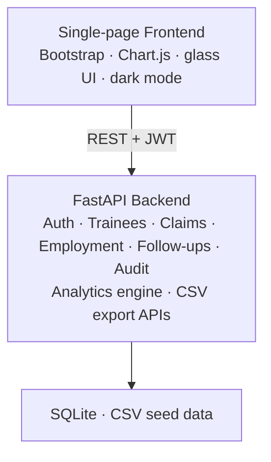

# KaushalTrace

### Longitudinal skilling & employment outcome intelligence

<p align="center">
  
  
  
  
  
</p>

**KaushalTrace** is a dual-portal platform for tracking skill training outcomes over time — from enrollment and certification through placement, wages, follow-ups, and evidence-backed verification.

Built for **accountability**: not auto-approved claims, but outcomes grounded in evidence, retention checkpoints, and programme-level analytics across district, course, and employer.

---

## Highlights

| Capability | What it delivers |
|---|---|
| **Dual portal** | Separate Admin and Trainee experiences with role-scoped data |
| **Evidence verification** | Rule-based verification — claims are not auto-verified |
| **Impact analytics** | District / course / employer tables **and** interactive graphs |
| **CSV intelligence** | Copy or download datasets by category for offline analysis |
| **Consent-first** | Trainee privacy and consent status are first-class |
| **Dark mode** | Full light-text dark theme across UI, tables, charts, and filters |

---

## Architecture



---

## Portals

### Admin portal
- **Analytics overview** — KPIs, outcome mix, evidence quality
- **Impact by region, course & employer** — filterable tables + bar graphs
- **Deep analytics** — verification, wages, courses, providers, follow-ups
- **CSV export** — category-wise copy & download (trainees, employment, wages, verification, …)
- **Claims queue** — verify / flag / reject with audit trail
- **Trainee directory** & longitudinal profile
- **Follow-up tracing** and **admin audit log**

### Trainee portal
- Personal **journey timeline** (consent → training → outcomes)
- Training records, outcome claims, employment signals
- Follow-ups and privacy / consent view
- Scoped strictly to the signed-in trainee

---

## Quick start

```bash
# 1. Clone
git clone https://github.com/samprit07/kaushaltrace.git
cd kaushaltrace

# 2. Environment
python -m venv .venv
# Windows
.venv\Scripts\activate
# macOS / Linux
source .venv/bin/activate

pip install -r requirements.txt

# 3. Run
uvicorn app.main:app --reload --host 127.0.0.1 --port 8000
```

Open **[http://127.0.0.1:8000](http://127.0.0.1:8000)**

### Demo logins

| Role | Username | Password |
|------|----------|----------|
| **Admin** | `admin` | `admin@kaushaltrace2026` |
| **Trainee** | `trainee1` | `trainee123` |

---

## Project structure

```text
kaushaltrace/
├── app/
│   ├── main.py                 # FastAPI app + static SPA mount
│   ├── auth.py                 # JWT / role guards
│   ├── database.py             # SQLite session & init
│   ├── models.py               # SQLAlchemy models
│   ├── schemas.py
│   ├── routers/
│   │   ├── auth.py
│   │   ├── analytics.py        # KPIs, impact matrix, CSV export
│   │   ├── claims.py
│   │   ├── trainees.py
│   │   ├── employment.py
│   │   ├── followups.py
│   │   ├── verification.py
│   │   ├── me.py               # Trainee-scoped APIs
│   │   └── admin.py            # Audit log
│   └── services/
│       ├── analytics_engine.py
│       ├── verification_service.py
│       └── followup_service.py
├── frontend/
│   └── index.html              # Dual-portal SPA
├── data/csv/                   # Seed datasets by category
├── analytics/                  # Offline analytics utilities
├── requirements.txt
└── HOW_TO_RUN.txt
```

---

## Analytics & CSV

### Impact views
- **By district / region** — trained, positive outcomes, placement rate
- **By training course** — trained, placed, rate
- **By employer / company** — placements, unique trainees, verified

Each view includes:
- Interactive **Chart.js** graphs
- **Copy CSV** and **Download CSV** for the live table

### Category export
Source CSVs available from the admin analytics UI (and API):

`trainees` · `training_records` · `outcome_claims` · `employment_records` · `wage_records` · `verification_records` · `evidence_records` · `followups` · `transitions` · `providers` · `courses` · `employers`

```http
GET /analytics/csv
GET /analytics/csv/{file_name}
```

*(Admin JWT required.)*

---

## Tech stack

| Layer | Choices |
|-------|---------|
| API | FastAPI, Pydantic, SQLAlchemy |
| Data | SQLite, pandas / numpy (analytics helpers) |
| UI | Bootstrap 5, Chart.js, Bootstrap Icons, Lucide |
| Auth | JWT bearer tokens, role-based access |
| UX | Glassmorphism, purple→blue gradient, grain, dark mode |

---

## Design principles

1. **Evidence over assertion** — outcomes move through verification states; they are not blindly trusted.
2. **Consent & privacy** — trainee portal never exposes programme-wide data.
3. **Accountability surfaces** — district, course, and employer impact are first-class.
4. **Exportability** — every major analysis can leave the app as CSV.
5. **Readable in the dark** — dark mode uses light text, chart ticks, and table colours by design.

---

## API surface (selected)

| Area | Prefix / notes |
|------|----------------|
| Auth | `/api/auth/*` |
| Me (trainee) | `/api/me/*` |
| Admin audit | `/api/admin/audit-log` |
| Analytics | `/analytics/*` (overview, verification, wages, impact-matrix, csv, …) |
| Trainees / claims / employment / follow-ups | REST routers under the app |

Interactive docs when the server is running:

- Swagger UI → [http://127.0.0.1:8000/docs](http://127.0.0.1:8000/docs)
- ReDoc → [http://127.0.0.1:8000/redoc](http://127.0.0.1:8000/redoc)

---

## Problem alignment (SIH 26135)

- Consent-based trainee records
- Training linked to placement / employment / self-employment / apprenticeship
- Automated + assisted follow-ups, retention & wage signals
- Evidence-based verification (not automatic claims)
- Admin: cohort · course · provider · district analytics + impact filters
- Trainee: privacy-scoped personal journey only

---

<p align="center">
  <strong>KaushalTrace</strong> — from training records to trusted outcomes.
</p>
